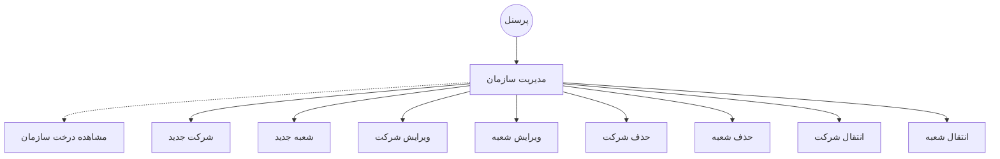

# مدیریت سازمان

### سناریو شماره یک - ثبت تیکت

1. کاربر با کلیک بر روی "درخت مدیریت سازمان" از قسمت "مدیریت سازمان" می تواند درخت سازمان را مشاهده و مدیریت بکند

2. جهت اضافه کردن شرکت جدید بر روی علامت ✚ کلیک کرده و شرکت را انتخاب میکند

3. اولین گره در درخت حتما می بایست یک شرکت باشد

4. جهت اضافه کردن یک شعبه جدید به زیر مجموعه یک شرکت بر روی علامت ▼ کلیک کرده و گزینه "شعبه جدید" را انتخاب میکند

5. جهت انتقال یک شرکت یا شعبه به زیر مجموعه شرکت یا شعبه دیگر بر روی علامت ▼ در کنار اسم شرکت یا شعبه کلیک کرده و گزینه "انتقال" را انتخاب می کند

6. امکال انتقال شعبه به عنوان ریشه درخت وجود ندارد

7. جهت حذف یک شرکت یا شعبه بر روی علامت ▼ در کنار اسم شرکت یا شعبه کلیک کرده و گزینه "حذف" را انتخاب می کند

8. جهت ویرایش یک شرکت یا شعبه بر روی علامت ▼ در کنار اسم شرکت یا شعبه کلیک کرده و گزینه "ویرایش" را انتخاب می کند

9. بعد از انجام تغییرات لازم بر روی گزینه "ذخیره" کلیک میکند

---

