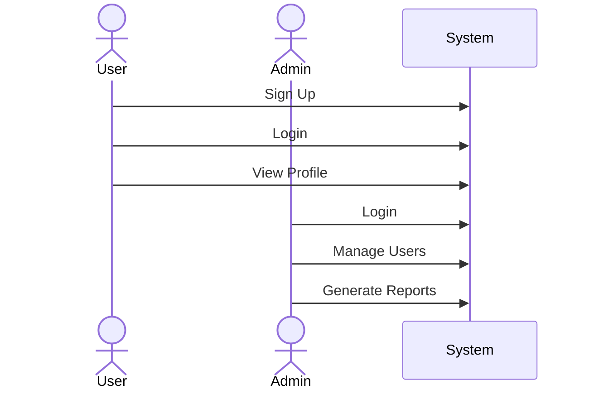

```mermaid
graph TD

  %% actors
  actor1((👤 کاربر))
  actor2((🙋 شخص))

  %% use cases
  UC1[ثبت تیکت]
  UC2[لیست تیکت ها]
  UC3[ارجاع تیکت به کاربر دیگر]
  UC4[تغییر وضعیت تیکت]
  UC5[نمایش تیکت ها در کارتابل]
  UC6[بستن تیکت]

  actor2 -.-> UC1
  actor2 -.-> UC2

  actor1 --> UC2
  actor1 --> UC3
  actor1 --> UC4
  actor1 --> UC5
  actor1 --> UC6

```

# صدای مشتری (تیکت):

### تعاریف پایه:

**تیکت:**
یک تیکت درخواستی است که به صورت عمومی قابل ثبت است. از قسمت مدیریت کالیبری هم تیکت های جدید قابل ثبت یا ویرایش هستند.

**موضوع:**
تیکت ها بر اساس موضوعات دسته بندی می شوند و در زمان تعریف هر موضوع، مشخص می شود که کدام واحد (از درخت منابع انسانی) از کدام شعبه (درخت سازمان) مسئول پیگیری تیکت های ثبت شده در آن موضوع هستند.

**نوع:**
ماهیت تیکت را مشخص می کند. انواع تیکت ها به صورت ثابت بوده و قابل تعریف یا ویرایش نیستند. تیکت های از نوع «شکایت» پس از «تکمیل شدن» باید توسط واحد/سمت تعیین شده در قسمت تنظیمات ماژول، پیگیری و تعیین تکلیف شوند (یا به وضعیت بسته شده بروند یا اینکه برای پیگیری بیشتر به واحد/سمت دیگری ارجاع شوند).

**واحد:**
واحد همان شعبه های تعریف شده در درخت سازمان هستند و مشخص می کنند که تیکت ثبت شده مربوط به کدام شعبه/قسمت از سازمان است.

---

### سناریو شماره یک - ثبت تیکت

1. شخص وارد فرم ثبت تیکت به آدرس /forms/crm/ticket/new می شود

2. فیلدهای مربوط به اطلاعات شخصی شامل نام، نام خانوادگی، شماره موبایل و آدرس ایمیل را وارد می کند

3. نوع درخواست را از لیست ثابت، انتخاب می کند

4. موضوع تیکت را از لیست موضوعات تعریف شده برای ماژول، انتخاب می کند

5. واحد مرتبط را از لیست تعریف شده بر اساس درخت سازمان در کالیبری انتخاب می کند

6. شرح یا متن مربوط به درخواست خود را در فیلد شرح وارد می کند

7. با ارسال (ذخیره تیکت) ، تیکت به واحد مشخص شده در قسمت موضوعات، ارسال می شود

8. در صورتی که حکم کارگزینی فعال کاربر به عنوان یکی از سمت های دریافت کننده موضوع تعیین شده باشد، تیکت برای کاربر نمایش داده می شود

9. کاربر می تواند تیک را باز کند، وضعیت آن را تغییر دهد یا اینکه آن را به کاربر دیگر (واحد.سمت دیگری) ارجاع دهد. این کاربر (واحد/سمت) می تواند هر کاربر (واحد/سمت) دیگری باشد

10. در صورتی که کاربر فعلی، تیکت را ارجاع دهد:
    - تیکت برای کاربر (واحد/سمت) دریافت کننده، نمایش داده خواهد شد و او می تواند وضعیت تیکت را تغییر داده یا آن را مجددا ارجاع دهد

11. در صورتی که کاربر فعلی، وضعیت تیکت را به وضعیت «تکمیل/انجام شده» تغییر می دهد:
    - در صورتی که تیکت از نوع «شکایت» نباشد:
        * وضعیت تیکت به صورت خودکار به وضعیت «بسته شده» تغییر می کند
    - در صورتی که تیکت از نوع «شکایت» باشد:
        * تیکت برای کاربرانی که در حکم کارگزینی فعال آنها به عنوان پیگیری کننده شکایات، در قسمت تنظیمات ماژول تیکتینگ تعیین شده است، نمایش داده می شود
        * کاربران پیگیری کننده شکایات، تیکت را بررسی و در صورتی که مشکل حل شده باشد، وضعیت تیکت را به صورت دستی به «بسته شده» تغییر می دهد. در صورتی که مورد شکایت حل نشده باشد، می تواند تیکت را به کاربر (واحد/سمت) دیگری ارجاع دهد.

---

---

